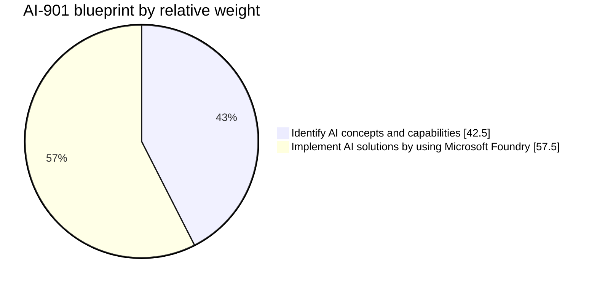

# AI-901 Deep Research Report — Part 1 of 4

> Preserved from the July 2026 deep-research session. Embedded ChatGPT citation markers are session-local; verify claims against current live sources before reuse.

# AI-901 Exam Certification Deep Research Report

## Executive summary

Microsoft’s AI-901 is not just AI-900 with a new number. The official blueprint was updated on April 15, 2026, and the public study guide now frames the exam around only two domains: **Identify AI concepts and capabilities** at **40–45%**, and **Implement AI solutions by using Microsoft Foundry** at **55–60%**. The audience profile also shifted: Microsoft now explicitly expects foundational technical skills, familiarity with Azure resources, and knowledge of Python syntax and programming techniques. That is a material change from the older AI-900 positioning, which targeted both technical and non-technical candidates with much less implementation depth. AI-900 itself retired on June 30, 2026, while the **Azure AI Fundamentals** certification remains active and is now earned through AI-901. citeturn8view0turn36view0turn7view0turn18search1turn18search6

Officially confirmed exam-format facts are narrower than many candidates expect, but they are still useful. Microsoft states that fundamentals exams are **45 minutes** of exam time and **65 minutes** of seat time, that most certification exams typically contain **40–60 questions**, that the passing score is **700**, that AI-901 is currently offered in **English**, and that **Microsoft Learn access is not available during fundamentals exams**. Microsoft also does **not** disclose specific question types in advance, instead pointing candidates to the exam sandbox. Practice Assessments are free and available through AI Skills Navigator, but Microsoft is explicit that they do **not** mirror the exact exam, length, or full complexity. citeturn28view0turn28view1turn36view0turn17view0

Real candidate reports are highly consistent on one point: AI-901 feels more technical than most people expect from a “fundamentals” exam. Repeated themes across blogs, Reddit, LinkedIn, and YouTube include unexpected Python/SDK recognition, strong emphasis on Microsoft Foundry, system prompts and prompt behavior, speech workloads, and hands-on familiarity with lightweight client applications and agents. Some successful candidates say the official materials were enough **if** they studied the code examples and actually completed the exercises; others, including people who failed, said the exam felt more code-heavy and less aligned to the visible learning paths than they expected. citeturn19view0turn19view1turn23view2turn24search14turn34view0turn34view1turn20search4

The most defensible study methodology for this exam is therefore not “read everything once.” It is a **blueprint-first, hands-on, retrieval-heavy** approach: derive your scope from the official skills outline, build small labs that mirror the verbs Microsoft uses, use paper notes as compressed retrieval sheets rather than transcripts, and use mocks plus an error log to close gaps. That approach is supported both by the exam blueprint itself and by learning-science evidence favoring practice testing, distributed practice, and retrieval practice over passive rereading. citeturn8view0turn17view0turn16search1turn16search13turn16search28turn34view0turn34view1

Relying on dumps is high-risk and ethically unsound. Microsoft’s security policy states that the use or sharing of exam content violates program rules, and the online-exam rules explicitly prohibit copying, recording, sharing, or discussing exam questions and answers. Even from a purely practical angle, dump-driven prep is an especially bad fit for AI-901 because the exam was refreshed recently, the English version changed on April 15, 2026, the study guide was updated again on July 13, 2026, and Microsoft says preview features may appear if they are commonly used. In other words: stale memorization is both risky and brittle here. citeturn22search7turn22search17turn36view0turn8view0

## Official exam map and recent changes

### What Microsoft currently confirms

The exam page and study guide agree on the current candidate profile: AI-901 is aimed at someone at the beginning of an AI-solution-development career, but not at a purely non-technical audience. Microsoft explicitly says candidates should know Python syntax, basic programming techniques, Azure resources, and be familiar with REST APIs, SDKs, and CLIs. Microsoft also notes that the bullets under each skill area are **illustrative**, not exhaustive, and that questions may include **Preview** features if they are commonly used. That language matters because it partially explains why candidates report feeling surprised by topics that were adjacent to, but not literally spelled out by, the most visible marketing summaries. citeturn36view0turn8view0

One additional nuance is worth calling out. Some Microsoft certification pages still surface legacy wording that describes AI-901 in the older “AI workloads and considerations / ML / vision / NLP / generative AI” style, while the exam page’s **Assessed on this exam** section and the full study guide clearly define the real active blueprint as the two-domain, Foundry-centered model. For preparation purposes, the study guide and the exam page’s assessed domains are the authoritative sources. citeturn36view0turn36view1turn15search3

Microsoft also publishes the broader fundamentals exam experience: most exams typically contain 40–60 questions, fundamentals exams run for 45 minutes with 65 minutes of total seat time, Learn access is unavailable during fundamentals exams, and question types are intentionally undisclosed before the exam. The exam sandbox is therefore not optional fluff; it is the only official way to preview the UI and interaction patterns. citeturn28view0turn36view0

The weighting below is the current official distribution. The values in the diagram use the midpoint of Microsoft’s published ranges. citeturn8view0turn36view0

### Skills measured map

| Official domain | Weight | What Microsoft says to know | What that means in practice |
|---|---:|---|---|
| **Identify AI concepts and capabilities** citeturn8view0turn36view0 | 40–45% | Responsible AI; how generative AI models work; choosing an appropriate model; deployment options and configuration parameters; scenarios for generative/agentic AI, text analysis, speech, vision, and information extraction; keyword extraction, entity detection, sentiment analysis, summarization; speech recognition and synthesis; computer vision and image generation; information extraction from text, images, audio, and video. citeturn8view0 | Expect scenario matching, service/feature differentiation, model-selection judgment, and the “why this tool vs that tool” style rather than pure definitions. Candidate reports strongly suggest these conceptual items are often wrapped in product-specific wording. citeturn19view0turn24search20 |
| **Implement AI solutions by using Microsoft Foundry** citeturn8view0turn36view0 | 55–60% | Create effective system and user prompts; deploy a model and interact with it in the Foundry portal; create a lightweight chat client with the Foundry SDK; create and test a single-agent solution; create a lightweight client app for an agent; build lightweight apps for text analysis, speech, vision, and information extraction; use deployed multimodal models; use Azure Content Understanding in Foundry Tools across documents, images, audio, and video. citeturn8view0 | This is the center of gravity of the exam. “Implement” in AI-901 does not mean heavy enterprise coding, but it absolutely does mean you should be able to recognize code, deployments, resource setup, and the practical flow from portal → model → client application → output. citeturn34view0turn34view1turn19view1 |

### Recent changes that matter for preparation

The most important change is structural: Microsoft replaced AI-900 with AI-901 because it wanted the Azure AI Fundamentals credential to align with current AI-solution-development expectations, especially Microsoft Foundry, Python, and modern Azure AI workflows. Microsoft publicly positioned AI-901 beta for April 2026, expected the live version in June 2026, and states that the English version of the exam was updated on April 15, 2026. The public AI-901 study guide was later updated on July 13, 2026. citeturn18search0turn18search1turn36view0turn8view0

The product surface itself is also changing under candidates’ feet. Microsoft Foundry now consolidates multiple earlier Azure AI experiences, and Microsoft notes that new investments are focused on the **new Foundry portal**, while older hub-based projects remain in the classic portal. Azure Language capabilities are also being folded more tightly into Foundry, with Microsoft noting that Language Studio authoring and testing workflows are now fully integrated into the Foundry platform. That ecosystem churn is probably one reason older AI-900 resources or stale third-party materials can feel misaligned. citeturn30view0turn26search18turn35search7

A second important change is service framing. Microsoft’s current training and docs consistently talk about building through **Foundry resources**, **Foundry SDKs**, and **Foundry Tools**, not only through the older standalone Cognitive Services or Azure OpenAI mental model. If you already know the older names, keep them as historical aliases, but study the newer Foundry-centric workflow first. citeturn30view1turn30view3turn27search3

## What real candidates report

### Cross-source pattern synthesis

Across blogs, Reddit threads, LinkedIn posts, and YouTube reviews, the strongest recurring pattern is that candidates who treated AI-901 as “still just a conceptual fundamentals exam” were the ones most likely to be blindsided. Multiple first-hand reports independently emphasize Python literacy, SDK recognition, Foundry portal familiarity, and system-prompt usage. The convergence across very different sources is strong enough to treat those topics as high-probability exam realities, even though no one candidate sees the exact same item set. citeturn19view0turn19view1turn23view2turn34view0turn34view1turn20search4

At the same time, the reports are not uniform in severity. Some passers say the exam is still clearly fundamentals-level and manageable with deep study of the official paths. Others say the alignment between Microsoft Learn and the real exam felt loose, especially during or near beta. The fairest reading is not that one side is wrong; it is that AI-901 appears to have **high variance in perceived difficulty depending on your developer comfort, portal familiarity, and ability to read Python code under time pressure**. citeturn23view0turn24search14turn24search23turn34view0

### Representative anonymized experiences
