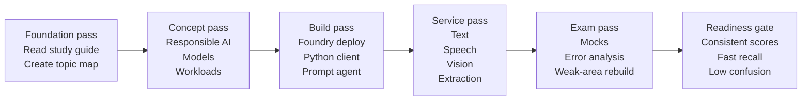

# AI-901 Deep Research Report — Part 4 of 4

> Preserved from the July 2026 deep-research session. Embedded ChatGPT citation markers are session-local; verify claims against current live sources before reuse.

```

That loop fits both the exam and the evidence. The **paper step** should happen after—not during—most of the learning. Read or build first, then close the screen and write: *What service fits this scenario? What inputs and outputs does it use? What portal or SDK step would I take? What common distractor is similar but wrong?* That is retrieval practice, and the research support for retrieval-heavy study is much stronger than for rereading or highlighting. citeturn16search1turn16search13turn16search28

### How to structure your paper notes

Use paper in three layers.

The first layer is a **domain notebook**. Keep one spread per major area: Foundry/models, prompts/agents, language/text, speech, vision/image generation, content understanding, responsible AI/security. For each spread, write only four things: common scenarios, correct service/tool, the workflow in order, and the top confusions. This keeps your notes tied to decision-making instead of encyclopedic copying. citeturn8view0turn32view3turn32view4turn33view3

The second layer is a **contrast deck**, either on paper or in flashcard software. Every card should force a distinction: *When would I use Azure Language vs a general-purpose chat model?*, *What makes Content Understanding different from Document Intelligence?*, *When is a prompt agent enough vs when do I need a hosted agent?* This style of active comparison aligns unusually well with AI-901 because many questions are likely to be “best fit under constraints” rather than trivia. citeturn32view5turn33view3turn8view0

The third layer is an **error ledger**. After every mock or practice block, log the missed item under one of three causes: *I did not know the concept*, *I knew the concept but confused similar Microsoft services*, or *I knew it but misread the scenario/code*. This helps you distinguish content gaps from exam-reading mistakes. Microsoft’s Practice Assessment supports this well because it gives answer rationales and links for every question. citeturn17view0

### Why spaced repetition and mixed review belong here

Spacing is especially important because AI-901 spans several service families that are easy to confuse when learned in one burst. The learning-science literature consistently rates **distributed practice** highly, and an additional body of work on spaced retrieval reinforces that revisiting material after delay helps long-term retention better than massed review. For this exam, that means every review session should mix at least two domains—for example, Foundry deployments plus speech, or prompts plus information extraction—rather than staying inside one silo for too long. citeturn16search1turn16search7turn16search3

### How mock exams should be used

Use mocks late enough that they measure understanding, but early enough that they still shape study. Microsoft’s own Practice Assessment is best used first because it reflects Microsoft’s wording style and provides rationales. After that, use only third-party mock sets that clearly say their questions are original, mapped to objectives, and current to the April 2026 AI-901 outline. Avoid any bank whose marketing depends on “real questions,” because that substitutes illegal memorization cues for actual capability and may teach the wrong product surface. citeturn17view0turn25search25turn22search7turn22search17

### Example unscheduled study timeline

This is a **relative** timeline, not a calendar. Move forward only when the exit criteria are true.



Your personal readiness gate for AI-901 should be stricter than “I finished the modules.” A much better gate is: **I can explain each official objective from memory, I have built at least one tiny hands-on example per implementation cluster, and my recent mocks show few errors caused by service confusion or code panic.** That gate is more faithful to both the blueprint and the real candidate feedback. citeturn8view0turn34view0turn34view1turn24search14

## Dump risk and ethical pattern analysis

Microsoft’s position is unambiguous: exam content is protected, and sharing or using copied exam material violates the rules of the credentials program. The online-exam rules also explicitly forbid copying, recording, sharing, or discussing questions and answers. From an ethics standpoint, that is enough reason not to use dumps. From a strategy standpoint, AI-901 gives you extra reasons: the exam is new, Microsoft refreshed it recently, and the product surface is evolving quickly. A dump can therefore be both unethical **and** operationally outdated. citeturn22search7turn22search17turn36view0turn8view0

The safest way to do “pattern analysis” without crossing the line is to analyze **topic recurrence**, not leaked items. That means using official sources plus public candidate reports to identify broad patterns such as: Python/SDK recognition is common; Foundry deployments and agents matter; prompt roles matter; speech appears often; Content Understanding is not a side topic; responsible AI can be tested through scenarios, not just principle names. All of those patterns are recoverable from legitimate sources without reproducing protected content. citeturn19view0turn19view1turn23view2turn34view0turn34view1turn20search4turn8view0

If you happen to encounter a dump site anyway, the only ethically defensible use is this: do **not** memorize or reproduce any items; do **not** treat it as ground truth; extract only the very high-level topic labels you can already validate against the official blueprint; then go back to Microsoft Learn and build the real skill. In practice, that means “I noticed these vendors obsess over Python, Foundry, speech, and scenarios” is acceptable pattern recognition, while “I memorized their answer bank” is not. citeturn25search21turn20search18turn22search7

### Bottom-line recommendations

The best final approach for **this specific exam** is:

1. Make the **AI-901 study guide** your master checklist, not the marketing summary. citeturn8view0turn36view0  
2. Complete both official learning paths, but treat them as **labs to execute**, not articles to skim. citeturn15search4turn15search7turn34view1  
3. Build at least one small implementation for each foundry-heavy objective cluster: model deployment, chat client, prompt agent, text, speech, vision, information extraction. citeturn8view0turn30view2turn33view2turn32view3turn32view0turn32view2turn32view4  
4. Use paper notes as **compressed retrieval tools**: contrasts, workflows, and error summaries only. citeturn16search30turn16search22turn16search28  
5. Use official and clearly original practice questions to drive an **error log** and targeted restudy. citeturn17view0turn25search25  
6. Do not use dumps for preparation. If you analyze “patterns,” keep that analysis at the topic level and validate everything against official Microsoft material. citeturn22search7turn22search17turn8view0

If your own experience tells you that writing things down strengthens your thinking, that is not a liability here. It is an advantage—**provided you write the right things**. For AI-901, the right things are not random notes. They are decision rules, product contrasts, code-flow recognition cues, and the exact workflow steps Microsoft expects you to understand. citeturn36view0turn8view0turn16search30turn34view0turn34view1
